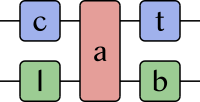

Catlab.jl is a framework for applied and computational category theory, written
in the [Julia](https://julialang.org) language. Catlab provides a programming
library and interactive interface for applications of category theory to
scientific and engineering fields. It emphasizes monoidal categories due to
their wide applicability but can support any categorical structure that is
formalizable as a generalized algebraic theory.

## What is Catlab?

Catlab is, or will eventually be, the following things.

**Programming library**: First and foremost, Catlab provides data structures,
algorithms, and serialization for applied category theory. Macros offer a
convenient syntax for specifying categorical doctrines and type-safe symbolic
manipulation systems. Wiring diagrams (aka string diagrams) are supported
through specialized data structures and can be serialized to and from GraphML
(an XML-based format) and JSON.

**Interactive computing environment**: Catlab can also be used interactively in
[Jupyter notebooks](http://jupyter.org). Symbolic expressions are displayed
using LaTeX and wiring diagrams are visualized using
[Compose.jl](https://github.com/GiovineItalia/Compose.jl),
[Graphviz](http://www.graphviz.org), or [TikZ](https://github.com/pgf-tikz/pgf).

**Computer algebra system**: Catlab will serve as a computer algebra system for
categorical algebra. Unlike most computer algebra systems, all expressions are
typed using fragment of dependent type theory called [generalized algebraic
theories](https://ncatlab.org/nlab/show/generalized+algebraic+theory). We will
implement core algorithms for solving word problems and reducing expressions to
normal form with respect to several important doctrines, such as those of
categories and of symmetric monoidal categories. For the computer algebra of
classical abstract algebra, see
[AbstractAlgebra.j](https://github.com/wbhart/AbstractAlgebra.jl) and
[Nemo.jl](https://github.com/wbhart/Nemo.jl).

### What is Catlab not?

Catlab is *not* currently any of the following things, although we do not rule
out that it could eventually evolve in these directions.

**Automated theorem prover**: Although there is some overlap between computer
algebra and automated theorem proving, Catlab cannot be considered a theorem
prover because it does not produce formal certificates of correctness
(aka proofs).

**Proof assistant**: Likewise, Catlab is not a proof assistant because it does
not produce formally verifiable proofs. Formal verification is not within scope
of the project.

**Graphical user interface**: Catlab does not provide a wiring diagram editor
or other graphical user interface. It is primarily a programming library, not a
user-facing application. However, it could be used as the backend for such an
application.

### What is a GAT?

Generalized Algebraic Theories (GATs) are the backbone of Catlab so let's expand a bit on GATs and how they fit into the bigger picture of algebra.

An algebraic structure, like a group or category, is a mathematical object whose axioms all take the form of equations that are universally quantified (the equations have no exceptions). That’s not a formal definition but it’s a good heuristic. There are different ways to make this precise. The oldest, going back to universal algebra in the early 20th centrury, are algebraic theories.

[Universal algebra](https://en.wikipedia.org/wiki/Universal_algebra) (sometimes called general algebra) is the field of mathematics that studies algebraic structures themselves, not examples ("models") of algebraic structures. For instance, rather than take particular groups as the object of study, in universal algebra one takes the class of groups as an object of study. In an algebraic theory, you have a collection of (total) operations and they obey a set of equational axioms. Classically, there is only a single generating type, but there are also typed or multi-sorted versions of algebraic theories. Most of the classical structures of abstract algebra, such as groups, rings, and modules, can be defined as algebraic theories.

Importantly, the theory of categories is [not algebraic](https://mathoverflow.net/q/354920). In other words, a category cannot be defined as a (multi-sorted) algebraic theory. The reason is that the operation of composition is partial, since you can only compose morphisms with compatible (co)domains. Now, categories sure feel like algebraic structures, so people have come up with generalizations of algebraic theories that accomodate categories and related structures.

The first of these was Freyd’s essentially algebraic theories. In an essentially algebraic theory, you can have partially defined operations; however, to maintain the equational character of the system, the domains of operations must themselves be defined equationally. For example, the theory of category would be defined as having two types, Ob and Hom, and the composition operation `compose(f::Hom,g::Hom)::Hom` would have domain given by the equation `codom(f) == dom(g)`. As your theories get more elaborate, the sets of equations defining the domains get more complicated and reasoning about the structure is overwhelming.

Later, Cartmell proposed generalized algebraic theories, which solves the same problem but in a different way. Rather than having partial operations, you have total operations but on dependent types (types that are parameterized by values). So now the composition operation has signature `compose(f::Hom(A,B), g::Hom(B,C))::Hom(A,C) where (A::Ob, B::Ob, C::Ob)`  exactly as appears in Catlab. This is closer to the way that mathematicians actually think and write about categories. For example, if you look at the definitions of category, functor, and natural transformation in Emily Riehl’s textbook, you will see that they are already essentially in the form of a GAT, whereas they require translation into an essentially algebraic theory. Nevertheless, GATs and essentially algebraic theories have the same expressive power, at least in their standard set-based semantics. GATs provide a version of the computer scientist's type theory that plays well with the mathematician's algebra, thus, providing a perfect opportunity for computer algebra systems.

## Table of Contents

```@contents
Pages = [
     "apis/core.md",
     "apis/theories.md",
     "apis/wiring_diagrams.md",
     "apis/graphics.md",
     "apis/programs.md",
     ]
Depth = 2
```
